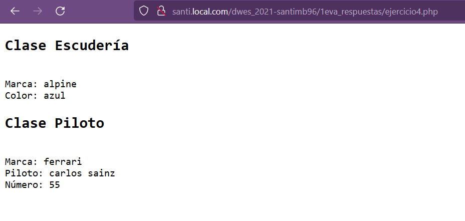
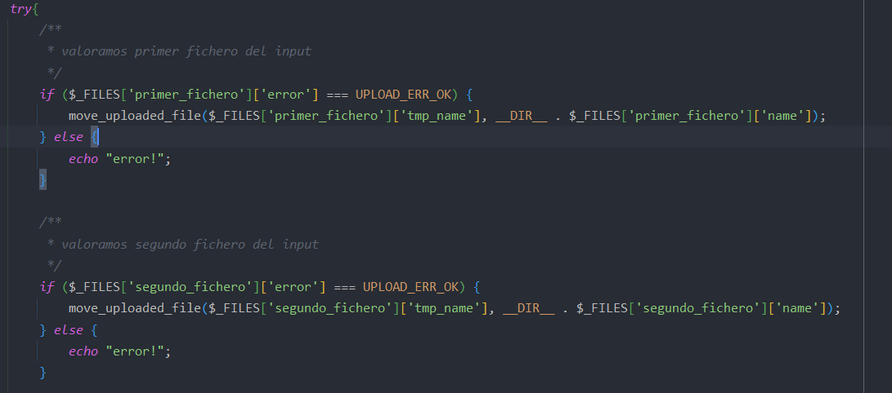
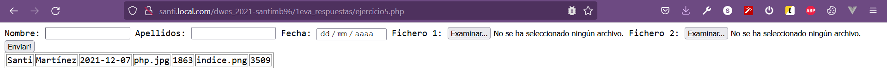

##EJERCICIO 4:

a) Sí. En el ejemplo detallado en el ejercicio4.php, he puesto de ejemplo dos clases: Escudería y Piloto.
Piloto extiende de escudería pero sin embargo sólo tiene el constructor y la herencia de la clase Escudería.
He puesto de ejemplo dos elementos en pantalla diferenciados. En el primero caso, instancio Escudería y le añado una marca;
además, le añado una propiedad denominada "color" la cual le defino que sea "azul".
Cuando pintamos los datos accediendo a las propiedades $escuderia->marca y $escuderia->color, me pinta el predeterminado + el añadido
por la función mágica __set();

Cuando instancio al hijo, en este caso le paso la marca y el nombre del piloto pero, además, creo una propiedad mediante $piloto->numero_piloto = 55
la cual establezco una nueva propiedad que es su dorsal y le adjudico 55.
Cuando pinto al Piloto, me pinta la marca de la escudería que le he pasado por constructor al heredar de Escudería y,
además, me pinta el nombre del piloto y el número de este.

Por lo tanto, al no especificar __set() y __get() en el hijo, se pueden acceder a los del padre.

b) En principio en herencias siempre se recomienda usar una visibilidad protegida debido a que sólo la herencia pueda acceder/ver
la propiedad del padre; si esta fuera pública, por ejemplo, la podrían ver todos.

Si es privada, a efectos prácticos haciendo pruebas, me ha seguido devolviendo las 
propiedades del padre+las del hijo, debido a esto:

`public function __construct($marca, $nombre)
{
$this->nombre = $nombre;
parent::__construct($marca);
}` al hacer parent::__constructor() accedo al constructor del padre y le paso la $marca recogida por el hijo, de manera 
que en este caso, la visibilidad no afecta para nada aunque se recomiende que sea protegida.

##EJERCICIO 5

En este ejercicio he creado los campos requeridos para el nombre, apellidos, un tipo "date"
y otros dos campos para la subida de ficheros los cuales tienen un identificador y name.

El control de los ficheros que se suben y se mueven al directorio ficheros/ se hace por fichero: en este caso, hay dos inputs los cuales se llaman
primer_fichero y segundo_fichero y se hacen dos `if else` para controlar que estos dos se suben correctamente:

Y este sería el resultado esperado con los ficheros subidos y el output que se solicita:

## EJERCICIO 6

El dominio a visitar para encontrar la lista de ejercicios subidos al remoto es:

[http://smartinez.ifc33b.cifpfbmoll.eu/dwes_2021-santimb96/1eva_respuestas/](http://smartinez.ifc33b.cifpfbmoll.eu/dwes_2021-santimb96/1eva_respuestas/)

o bien con el nombre de noip:

[http://smartinezbota.ddns.net/dwes_2021-santimb96/1eva_respuestas/](http://smartinezbota.ddns.net/dwes_2021-santimb96/1eva_respuestas/)

En el repositorio 1eva_respuestas se encuentran los ficheros ejercicio4.php y ejercicio5.php que corresponden a las preguntas 4 y 5
del examen. Las imágenes que hay en la raíz de esta carpeta corresponden a las capturas de pantalla aportadas en el README.md. Por
último, el directorio que hay dentro, ficheros/, se almacenan las imágenes que se han probado para el ejercicio5.php en el apartado de ficheros.

