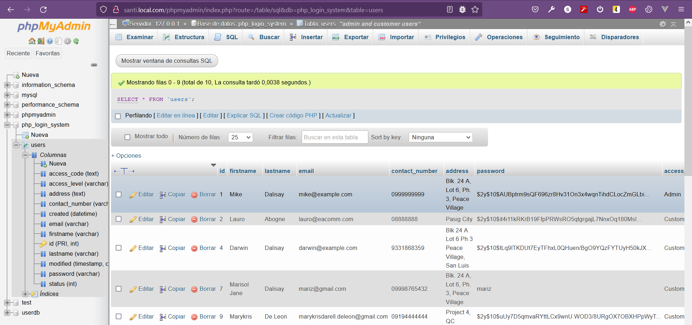
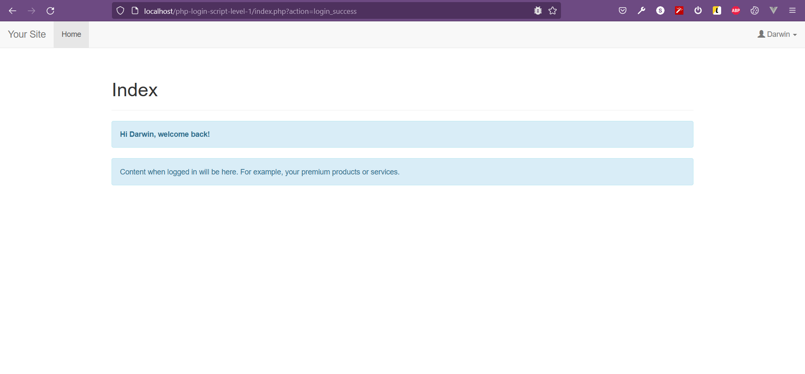

# LOGIN-SYSTEM (TUTORIAL DE CODEOFANINJA.COM)

## AUTOR: SANTIAGO MARTÍNEZ

## CURSO: 2º DAW

## ASIGNATURA: DWES

## INFORMACIÓN PHPMYADMIN:

### COMPROBACIÓN DE QUE LA BASE DE DATOS SE HA CREADO:

### IMPORTANTE EJECUTAR _sql_database/php_login_system.sql_ en _**phpMyAdmin**_

### COMPROBACIÓN DEL LOGIN EXITOSO:

### CREDENCIALES PARA PODER PROBAR EL LOGIN DE ARRIBA:

**Username: darwin@example.com  
Password: darwin12qw!@QW**

